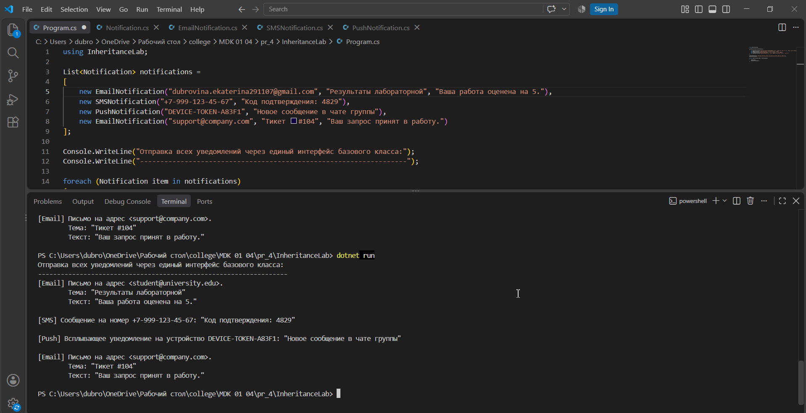

# Практическая работа № 4: Реализация наследования и виртуальных методов

**Вариант:** 8
**Студент:** Дубровина Е.А.

## Задание
Уведомления: Notification (базовый), EmailNotification, SMSNotification, PushNotification. Виртуальный метод Send().

## Код программы

### Базовый класс (Notification.cs)

```csharp
namespace InheritanceLab;

public class Notification
{
    // Свойства, общие для всех типов уведомлений
    public string Recipient { get; set; }
    public string Message { get; set; }

    // Конструктор базового класса
    public Notification(string recipient, string message)
    {
        Recipient = recipient;
        Message = message;
    }

    // Ключевое слово virtual разрешает классам-потомкам переопределять этот метод
    public virtual void Send()
    {
        Console.WriteLine($"[Базовое уведомление] Отправка сообщения '{Message}' для {Recipient}");
    }
}
```

### Производный класс (EmailNotification.cs)

```csharp
namespace InheritanceLab;

public class EmailNotification : Notification
{
    // Уникальное свойство только для email
    public string Subject { get; set; }

    // Вызываем конструктор базового класса с помощью : base(...)
    public EmailNotification(string recipient, string subject, string message) 
        : base(recipient, message)
    {
        Subject = subject;
    }

    // Переопределение метода
    public override void Send()
    {
        Console.WriteLine($"[Email] Письмо на адрес <{Recipient}>.");
        Console.WriteLine($"        Тема: \"{Subject}\"");
        Console.WriteLine($"        Текст: \"{Message}\"");
    }
}
```


### Основной код программы (Program.cs)

```csharp
using InheritanceLab;

List<Notification> notifications = 
[
    new EmailNotification("dubrovina.ekaterina291107@gmail.com", "Результаты лабораторной", "Ваша работа оценена на 5."),
    new SMSNotification("+7-999-123-45-67", "Код подтверждения: 4829"),
    new PushNotification("DEVICE-TOKEN-A83F1", "Новое сообщение в чате группы"),
    new EmailNotification("support@company.com", "Тикет #104", "Ваш запрос принят в работу.")
];

Console.WriteLine("Отправка всех уведомлений через единый интерфейс базового класса:");
Console.WriteLine("------------------------------------------------------------------");

foreach (Notification item in notifications)
{
    item.Send();
    Console.WriteLine();
}
```

## Скриншоты


